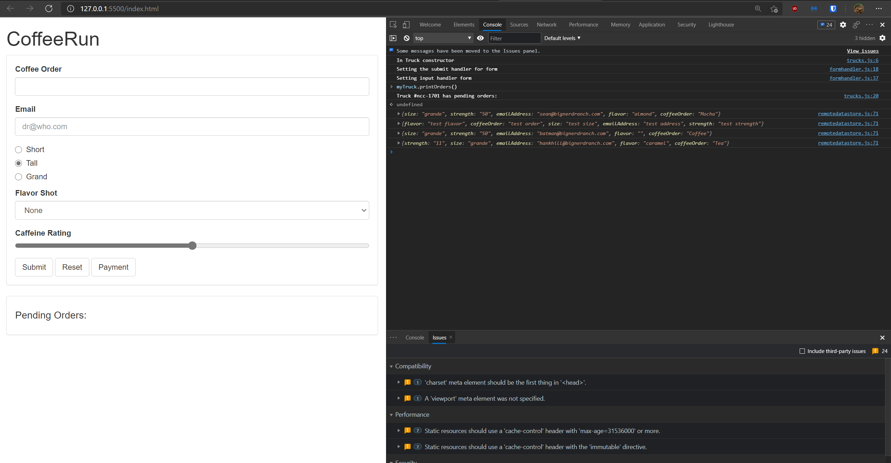
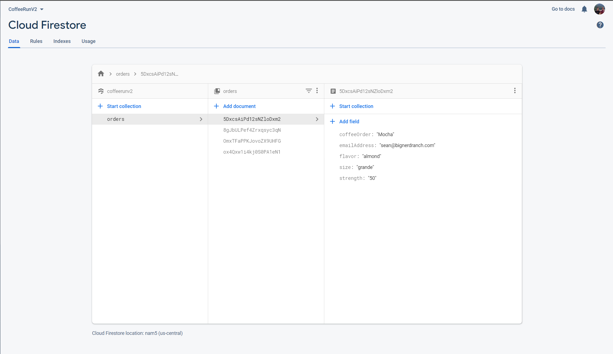

# CPSC-349-HW4 CoffeeRun Part 2

- [x] submitted orders are stored in FireStore
- [x] orders are 'delivered' and deleted from FireStore
- [x] can query FireStore
- [x] Firestore data can be viewed with myTruck.printOrders()

